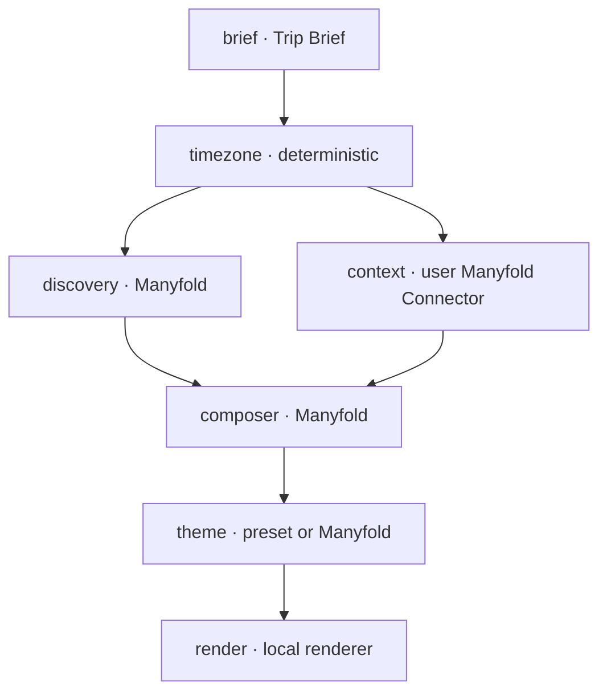

# Agent 编排

Travel Ticket 使用应用自建 DAG 管理长任务。Cloudflare 只提供 Durable Object、
Queue 和 alarm；不使用 Cloudflare Workflows。

## 执行图

实际依赖定义在 `worker/trip-job.ts`；前端不得自行推测执行拓扑。

## Role peers

| 角色 | 配置项 | 任务 |
|---|---|---|
| Source identity | `MF_AGENT_ID` | mint peer credential |
| Brief | `AGENT_BRIEF` | 将一句话转为结构化 trip brief |
| Discovery | `AGENT_DISCOVERY` | 目的地资料与来源 |
| Private context | disabled | 当前使用空 context，不调用 External Client |
| Composer | `AGENT_COMPOSER` | 合并资料生成 itinerary |
| Theme designer | `AGENT_THEME_DESIGNER` | 生成自定义视觉 tokens |

生产环境必须为四个启用中的 role 分别配置 peer，不使用共享 Agent fallback。

## Manyfold A2A 调用

一次调用遵循固定顺序：

1. 使用 `MF_API_TOKEN` 和 `MF_AGENT_ID` 为目标 peer mint 短期 credential。
2. 向返回的 `rpcUrl` 发送 JSON-RPC `message/send`，设置
   `configuration.blocking=false`。
3. 如果响应已经包含最终 Message，直接解析。
4. 如果响应是 `submitted` 或 `working` Task，只使用 `tasks/get` 轮询原 task。
5. 到达终态后读取 artifacts、message 或 status message。
6. 超时会尝试 `tasks/cancel`；已接受的 task 不会再次提交 prompt。

Peer credential cache 以 API URL、source agent 和 peer ID 共同隔离。401 会清除
对应 credential；错误消息会截断并清理 bearer/JWT 字样。

默认一次 A2A 调用最多两次 transport attempt，每次最多四分钟。HTTP 408、409、
425、429、5xx 和明确的临时网络错误可以重试；参数、认证、schema 和无效 JSON
错误最终会明确失败。

## Workflow 状态机

任务状态为 `pending → running → done`，失败时可能回到 `pending` 等待重试，
最终进入 `failed`。Job 状态为
`draft → queued → running → done | error`。创建 draft 不会发布 Queue；只有用户
调用幂等 `start()` 后进入 queued；当前不需要 Connector 页面。

- Queue 是 at-least-once delivery，不能作为状态真相来源。
- draft 最多保留 24 小时，避免未完成 Connector 步骤的任务永久占用状态。
- `claim()` 生成 lease ID；只有相同 lease ID 能 complete/fail。
- 任务 retry delay 从 30 秒指数增长，最高五分钟。
- lease 过期后重新进入 pending；第三次 lease 过期变为 terminal error。
- Queue 发布失败由 alarm 重新对账，不会丢失已经接受的 trip。
- 非 retryable 业务错误立即终止当前 workflow task。

## 失败和降级

| 步骤 | 失败行为 |
|---|---|
| Brief | 硬失败；没有 brief 不能继续 |
| Timezone | 使用 UTC 安全结果 |
| Discovery | 使用空 POI、交通和来源 |
| Private context | 当前停用，诚实标记 skipped 并使用空 context |
| Composer | 使用本地 composer 生成可渲染结果 |
| Custom theme | 回退到目的地 preset |
| Render / persistence | 硬失败并展示原因 |

Fallback 不应伪装为真实 Agent 成功。生成的 itinerary 会保存 `agent_statuses`，
进度 API 同时返回角色状态、任务 attempt 和可展示的错误。

## 进度与排错

`GET /api/trips/:id` 返回：

- `phase`、`trip_id`、`updated_at`；
- `agents`：面向用户的角色状态；
- `tasks`：内部任务状态、attempt、max attempts 和错误；
- `log`：最近的可读状态；
- `manifest` 或 terminal `error`。
- `links`：connect、start、progress 和 result 的 canonical URL。

`GET /api/trips/:id/status` 仅作为旧客户端兼容别名保留。

排错时先找失败 task，再判断是 credential mint、A2A Task、Manyfold Connector、
renderer 还是持久化错误。不要仅根据 Agent 显示名称推测失败来源。
