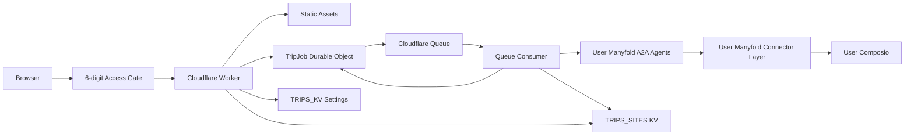

# 系统架构

本文描述公开 Cloudflare 服务的当前实现。本地 Studio、CLI 和 MCP 仍可独立使用，
但不参与生产请求的执行或部署。

## 系统组件

- `worker/entry.ts`：Worker 入口，导出 HTTP handler、Queue consumer 和
  `TripJob` Durable Object。
- `worker/index.mjs`：可由 Node 测试的 HTTP router。
- `worker/trip-job.ts`：DAG 状态、依赖、租约、重试和清理。
- `worker/trip-task.ts`：领取任务并执行 Manyfold A2A 和渲染步骤。
- `worker/pipeline-steps.mjs`：可测试的单步业务函数及 fallback。
- `pipeline/mf-client.mjs`：Manyfold A2A credential、调用和任务轮询。

`ASSETS.run_worker_first` 保证 canonical redirect、API 和生成站点先经过上述 router；
未匹配的应用静态资源再由 `ASSETS.fetch()` 提供，避免 Cloudflare 自动 HTML routing
抢先处理 `.html` 兼容 URL。

## HTTP 路由

| 路由 | 方法 | 作用 |
|---|---|---|
| `/` | GET | 静态应用入口 |
| `/access` | GET | 6 位访问口令页面 |
| `/api/access/status` | GET | 查询门禁配置与当前 session |
| `/api/access/login` | POST | 验证口令并签发访问 cookie |
| `/api/access/logout` | POST | 清除访问 cookie |
| `/settings` | GET | 管理配置页面 |
| `/api/admin/session` | POST/DELETE | 登录和退出配置页面 |
| `/api/admin/settings` | GET/PUT | 读取和保存配置 |
| `/api/config` | GET | 仅返回公开配置与 readiness |
| `/api/trips` | POST | 按 IP 限流后创建 draft |
| `/api/trips/:id` | GET | 获取 trip 和 workflow 状态 |
| `/api/trips/:id/start` | POST | 幂等启动 draft |
| `/api/trips/:id/agent` | GET | 预留的 Manyfold host-agent binding 状态 |
| `/api/trips/:id/connectors` | GET | 获取全部 connector 状态 |
| `/api/trips/:id/connectors/:provider` | GET | 查询单个 connector |
| `/api/trips/:id/connectors/:provider/link` | POST | 兼容入口；提示回 Manyfold 完成 provider setup |
| `/trips/:id/connect` | GET | 旧版兼容页面；当前新流程不会导向 |
| `/trips/:id/progress` | GET | 展示 workflow 进度 |
| `/trips/:id/` | GET | 最终手册；无尾斜杠版本 308 到此路径 |
| `/trips/:id/*` | GET/HEAD | 读取手册静态文件 |

JSON API 响应禁止缓存并带 `X-Content-Type-Options: nosniff`。不存在的 trip 或文件
分别返回受控 JSON 或 HTML 404。旧的 `.html` 页面、`/status` 和 `/connect/*`
API 暂时保留为兼容重定向或别名。

除 `/access`、`/settings` 及其必要 API/静态资源外，所有页面、生成的 trip 文件
和业务 API 都经过服务端 access guard。页面未登录时 302 到 `/access?next=...`；
API 返回 401 `ACCESS_REQUIRED`。口令尚未配置时 API 使用 503
`ACCESS_NOT_CONFIGURED`，不会退化成公开访问。

## 创建一次 trip

1. 访客在 `/access` 输入 6 位口令，取得绑定当前口令版本的签名 cookie。
2. 浏览器读取 `/api/config`。Manyfold 未配置完整时，出票按钮不可用。
3. `POST /api/trips` 执行 Workers Rate Limiting。
4. Worker 创建以 `tripId` 命名的 draft `TripJob`。
5. 浏览器立即调用 `POST /api/trips/:id/start`。若 operator 尚未在 `/settings`
   连接 Manyfold agents，该呼叫会回 409 `manyfold_reconnect_required`。
6. `TripJob` 发布可运行任务；Queue consumer 取得租约并调用已配置的 pipeline agents。
7. Private Context task 记录 skipped 和空 context，不发出 A2A connector 请求。
8. 浏览器在 `/trips/:id/progress` 轮询 canonical trip resource。
9. `render` 写入 `TRIPS_SITES`，浏览器跳转到 `/trips/:id/`。

## 数据归属

| 绑定 | 保存内容 | 一致性要求 |
|---|---|---|
| `TRIP_JOBS` | workflow 参数、任务状态、紧凑输出、错误 | 强一致 |
| `TRIPS_SITES` | 生成的 HTML/CSS/JS/manifest/JSON | 最终产物 |
| `TRIPS_KV` | 加密 runtime settings、短期 access 登录失败计数 | 配置与门禁 |
| `TRIP_TASK_QUEUE` | `{jobId, taskId}` 通知 | at-least-once |
| `ASSETS` | 入口、进度和设置页 | 构建时静态资源 |

Queue 消息不携带 prompt、connector 数据或任务输出。外部任务执行所需数据从
Durable Object claim 读取，避免消息重复投递导致状态分叉。

Travel Ticket 当前不保存或传递 Composio credentials，也不保存 trip-scoped
credential。Private Context 仅以空 context 进入 Composer，当前不保存 host-agent binding
或 normalized private context。

## 生命周期

- 每个任务最多三次 workflow attempt。
- draft 在 24 小时内未启动会由 alarm 清理。
- 任务租约十分钟；活动任务至少每分钟由 Durable Object alarm 对账。
- 重复 Queue 消息必须取得当前租约才能执行和提交结果。
- 完成和失败的 job 保留七天，随后由 alarm 清理。
- `GET /api/trips/:id` 只读取 Durable Object，避免出现两个 workflow 状态源。

## 两种运行模式

| 模式 | 入口 | 用途 | 数据位置 |
|---|---|---|---|
| 生产 Worker | `npm run dev` / GitHub Actions | 公开网页、持久 workflow | Durable Object + KV |
| 本地工具 | `npm run studio:local`、`npm run plan`、`npm run mcp` | 开发、CLI、MCP client | 本地 `data/`、`dist/` |

两种模式复用 agent、schema 和 renderer，但只有生产 Worker 使用 Durable Object
和 Queue。4747 的 Local Studio 不提供 Worker 配置；访问其 `/settings` 会跳转到
8788。任何本地命令都不应发布生产 Worker。
